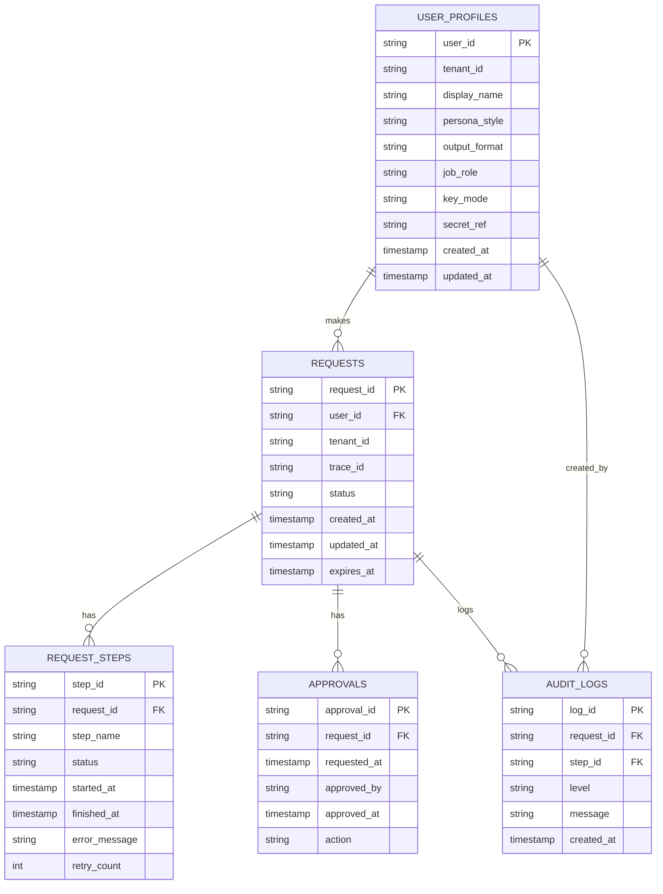

# 데이터베이스 스키마

모든 요청, 단계, 승인, 감시, 사용자 정보를 저장하는 데이터베이스 구조입니다.

## ERD (Entity Relationship Diagram)



## 테이블 상세 정의

### 1. requests
주요 요청의 생명주기 저장.

| 컬럼명 | 타입 | NOT NULL | PK | INDEX | 설명 |
|---|---|---|---|---|---|
| request_id | UUID | ✅ | ✅ | ✅ | 요청 단위 고유 키 |
| user_id | VARCHAR(20) | ✅ | ❌ | ✅ | Slack user ID |
| tenant_id | VARCHAR(100) | ✅ | ❌ | ❌ | 팀/조직 ID (현재: 'DEFAULT') |
| trace_id | UUID | ✅ | ❌ | ❌ | 전체 추적 키 |
| status | VARCHAR(20) | ✅ | ❌ | ✅ | RECEIVED, PARSING, ... (Enum) |
| created_at | TIMESTAMP | ✅ | ❌ | ✅ | 생성 시각 |
| updated_at | TIMESTAMP | ✅ | ❌ | ❌ | 마지막 수정 시각 |
| expires_at | TIMESTAMP | ✅ | ❌ | ❌ | 자동 취소 시각 |

### 2. request_steps
각 요청별 단계별 실행 로그.

| 컬럼명 | 타입 | NOT NULL | PK | INDEX | 설명 |
|---|---|---|---|---|---|
| step_id | UUID | ✅ | ✅ | ✅ | 단계 고유 키 |
| request_id | UUID | ✅ | ❌ | ✅ | 부모 요청 ID (FK) |
| step_name | VARCHAR(50) | ✅ | ❌ | ❌ | PARSING, MEETING_DONE, ... (Enum) |
| status | VARCHAR(20) | ✅ | ❌ | ❌ | PENDING, RUNNING, SUCCESS, FAILED (Enum) |
| started_at | TIMESTAMP | ❌ | ❌ | ❌ | 단계 시작 시각 |
| finished_at | TIMESTAMP | ❌ | ❌ | ❌ | 단계 완료 시각 |
| error_message | TEXT | ❌ | ❌ | ❌ | 실패 시 오류 메시지 |
| retry_count | INT | ✅ | ❌ | ❌ | 재시도 횟수 (기본값: 0) |

### 3. approvals
승인 기록. 쓰기 작업 전에 필수.

| 컬럼명 | 타입 | NOT NULL | PK | INDEX | 설명 |
|---|---|---|---|---|---|
| approval_id | UUID | ✅ | ✅ | ✅ | 승인 기록 고유 키 |
| request_id | UUID | ✅ | ❌ | ✅ | 부모 요청 ID (FK) |
| requested_at | TIMESTAMP | ✅ | ❌ | ❌ | 승인 요청 시각 |
| approved_by | VARCHAR(20) | ❌ | ❌ | ❌ | 승인자 user_id (NULL = 미승인) |
| approved_at | TIMESTAMP | ❌ | ❌ | ❌ | 승인 시각 |
| action | VARCHAR(20) | ✅ | ❌ | ❌ | APPROVED, REJECTED, CANCELED (Enum) |

### 4. audit_logs
모든 작업 이벤트 로그. 감시와 문제 추적용.

| 컬럼명 | 타입 | NOT NULL | PK | INDEX | 설명 |
|---|---|---|---|---|---|
| log_id | UUID | ✅ | ✅ | ✅ | 로그 고유 키 |
| request_id | UUID | ✅ | ❌ | ✅ | 부모 요청 ID (FK) |
| step_id | UUID | ❌ | ❌ | ❌ | 부모 단계 ID (FK, optional) |
| level | VARCHAR(20) | ✅ | ❌ | ✅ | INFO, WARN, ERROR, APPROVAL, DONE (Enum) |
| message | TEXT | ✅ | ❌ | ❌ | 로그 메시지 |
| created_at | TIMESTAMP | ✅ | ❌ | ✅ | 로그 생성 시각 |

### 5. user_profiles
사용자별 개인화 설정 및 키 정보. 계정과 선호도 저장.

| 컬럼명 | 타입 | NOT NULL | PK | INDEX | 설명 |
|---|---|---|---|---|---|
| user_id | VARCHAR(20) | ✅ | ✅ | ✅ | Slack user ID |
| tenant_id | VARCHAR(100) | ✅ | ❌ | ❌ | 팀/조직 ID |
| display_name | VARCHAR(100) | ✅ | ❌ | ❌ | 사용자 표시명 |
| persona_style | VARCHAR(50) | ✅ | ❌ | ❌ | pm, developer, designer, concise (Enum) |
| output_format | VARCHAR(50) | ✅ | ❌ | ❌ | markdown, bullet_list, json (Enum) |
| job_role | VARCHAR(50) | ❌ | ❌ | ❌ | 직책: 'PM', 'Engineer', 'Designer', ... |
| key_mode | VARCHAR(20) | ✅ | ❌ | ❌ | shared, byok (Enum, 기본: 'shared') |
| secret_ref | VARCHAR(255) | ❌ | ❌ | ❌ | byok일 경우 암호화된 API 키 참조 (KMS path) |
| created_at | TIMESTAMP | ✅ | ❌ | ❌ | 프로필 생성 시각 |
| updated_at | TIMESTAMP | ✅ | ❌ | ❌ | 프로필 수정 시각 |

## 인덱스 전략

```sql
-- requests 테이블
CREATE INDEX idx_requests_user_id ON requests(user_id);
CREATE INDEX idx_requests_status ON requests(status);
CREATE INDEX idx_requests_created_at ON requests(created_at);

-- request_steps 테이블
CREATE INDEX idx_request_steps_request_id ON request_steps(request_id);

-- approvals 테이블
CREATE INDEX idx_approvals_request_id ON approvals(request_id);

-- audit_logs 테이블
CREATE INDEX idx_audit_logs_request_id ON audit_logs(request_id);
CREATE INDEX idx_audit_logs_level ON audit_logs(level);
CREATE INDEX idx_audit_logs_created_at ON audit_logs(created_at);

-- user_profiles 테이블
-- PK index는 자동으로 생성됨
```

## 보존 정책 (Retention Policy)

| 테이블 | 보존 기간 | 정책 | 비고 |
|---|---|---|---|
| requests | 90일 | 자동 삭제 (PoC 이후 조정) | 현재는 테스트용 |
| request_steps | 90일 | requests와 함께 cascade delete | |
| approvals | 2년 | 감시 용도 보관 | 중요하므로 길게 유지 |
| audit_logs | 1년 | 보관 (압축 가능) | 문제 추적용 필수 |
| user_profiles | 무한 | 계정 삭제 시까지 보관 | 장기 유지 |

## 초기화 쿼리

```sql
-- 테이블 삭제 (개발 중용)
DROP TABLE IF EXISTS audit_logs;
DROP TABLE IF EXISTS approvals;
DROP TABLE IF EXISTS request_steps;
DROP TABLE IF EXISTS requests;
DROP TABLE IF EXISTS user_profiles;

-- 기본 사용자 프로필 생성 (테스트용)
INSERT INTO user_profiles (user_id, tenant_id, display_name, persona_style, output_format, job_role, key_mode)
VALUES 
  ('U12345678', 'T_DEFAULT', 'Alice PM', 'pm', 'markdown', 'PM', 'shared'),
  ('U87654321', 'T_DEFAULT', 'Bob Engineer', 'developer', 'markdown', 'Engineer', 'shared'),
  ('U11111111', 'T_DEFAULT', 'Charlie Designer', 'designer', 'markdown', 'Designer', 'shared');
```

