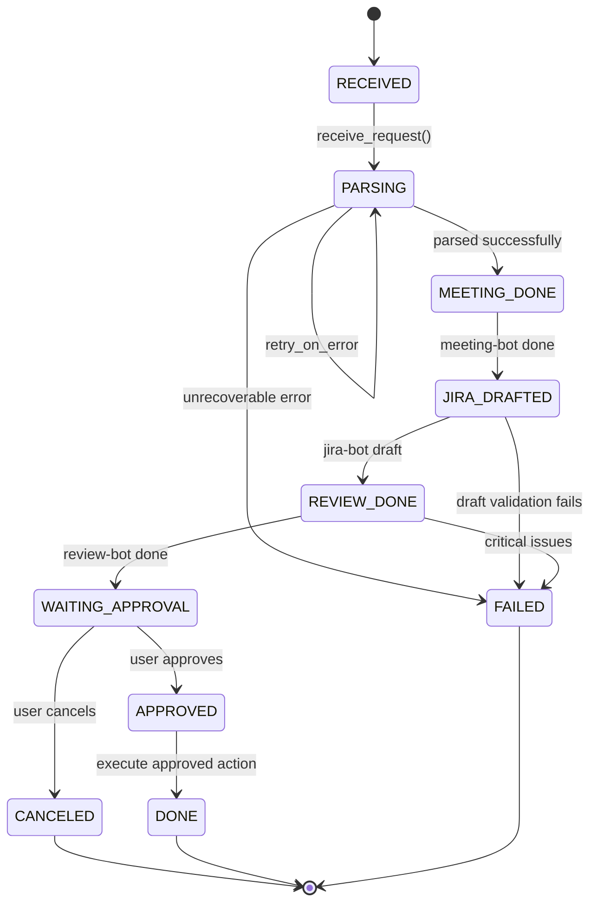

# 요청 상태 머신

모든 요청의 생명주기를 명시적 상태 전이로 정의합니다.

## 상태 전이도

## 상태별 정의표

| 상태 | 진입 조건 | 담당 서비스 | 실패 시 전이 | 타임아웃 |
|---|---|---|---|---|
| RECEIVED | user_id + raw_text 수신 | Slack receiver | FAILED | 60s |
| PARSING | transcript/text 형식 확인 | orchestrator | FAILED | 120s |
| MEETING_DONE | LLM parse 완료 | meeting-bot | FAILED | 180s |
| JIRA_DRAFTED | draft 스키마 생성 | jira-bot | FAILED | 120s |
| REVIEW_DONE | 검수 통과 | review-bot | FAILED | 90s |
| WAITING_APPROVAL | 승인 화면 표시 | Slack UI | CANCELED (타임아웃 180s) | 600s (10min) |
| APPROVED | user clicks approve | approvals handler | (success → DONE) | - |
| DONE | 최종 상태 | logger | (terminal) | - |
| FAILED | 재시도 초과/권한오류 | error handler | (terminal) | - |
| CANCELED | user clicks cancel | Slack UI | (terminal) | - |

## 상태 전이 상세

### RECEIVED → PARSING
- **트리거**: `receive_request(user_id, tenant_id, raw_text)` API 호출
- **체크**: user_id 유효성, raw_text 길이 > 10 chars, user_profiles에 존재 여부
- **액션**: requests 테이블에 새 row (status=PARSING), trace_id 생성, Slack DM에 "요청을 접수했습니다" 응답
- **롤백**: 60초 타임아웃 시 자동으로 FAILED 상태로 변경

### PARSING → MEETING_DONE
- **트리거**: meeting-bot이 transcript 파싱 완료
- **체크**: decisions/action_items/open_questions 모두 형식 유효
- **액션**: request_steps에 step 기록, 상태 업데이트, 오케스트레이션 채널 스레드에 진행 로그
- **롤백**: 파싱 실패 시 재시도 3회 (exponential backoff)

### MEETING_DONE → JIRA_DRAFTED
- **트리거**: jira-bot이 action_items를 draft로 변환 완료
- **체크**: draft validation pass (필드 채움 > 80%)
- **액션**: request_steps에 기록, draft 요약을 오케스트레이션 채널에 업데이트
- **롤백**: validation 실패 시 FAILED로 전이

### JIRA_DRAFTED → REVIEW_DONE
- **트리거**: review-bot이 draft 검수 완료
- **체크**: 중복도 < 0.8, 완성도 > 60%
- **액션**: 검수 결과 기록, 오케스트레이션 채널에 warnings 표시
- **롤백**: 검수 실패 (critical issues 있음) 시 FAILED로 전이

### REVIEW_DONE → WAITING_APPROVAL
- **트리거**: 모든 자동 처리 완료
- **체크**: approval_required=true (Jira 관련 쓰기 작업)
- **액션**: approvals 테이블에 requested_at 기록, 오케스트레이션 채널에 승인 버튼 메시지 발송, 600초 타임아웃 설정
- **롤백**: 600초 경과 시 자동으로 CANCELED 상태로 변경

### WAITING_APPROVAL → APPROVED
- **트리거**: user가 "Approve" 버튼 클릭
- **체크**: action_key 중복 검사 (idempotency), approver 권한 확인
- **액션**: approvals.approved_by = user_id, approved_at = now(), action = APPROVED, 상태 전이, 다음 실행 단계 enqueue
- **롤백**: 승인 후 실행 실패 시 DONE이 아닌 FAILED로 전이해도 승인 기록은 유지

### WAITING_APPROVAL → CANCELED
- **트리거**: 1) user가 "Cancel" 버튼 클릭 또는 2) 600초 타임아웃
- **체크**: 현재 상태가 WAITING_APPROVAL인지 확인
- **액션**: approvals 테이블에 action=CANCELED 기록, running worker 중단 신호 발송 (if any), Slack DM에 취소 메시지
- **롤백**: 취소 후 복구 불가 (terminal state)

